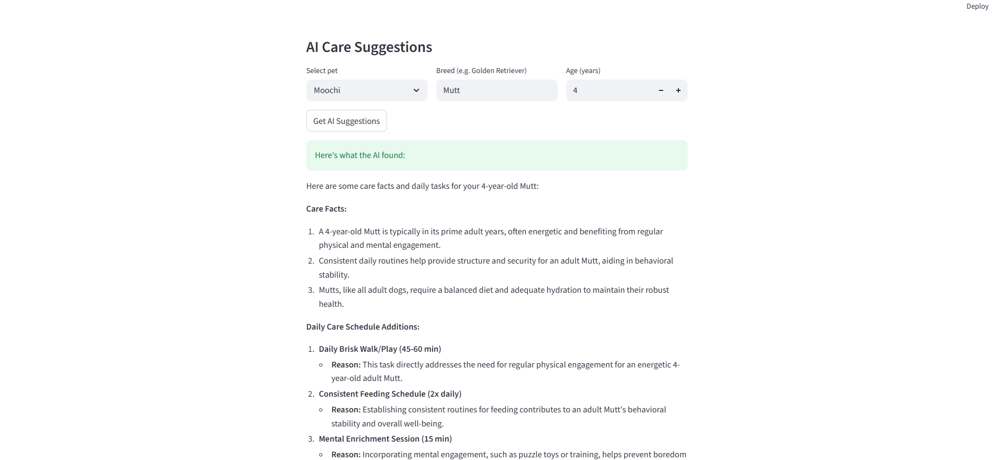
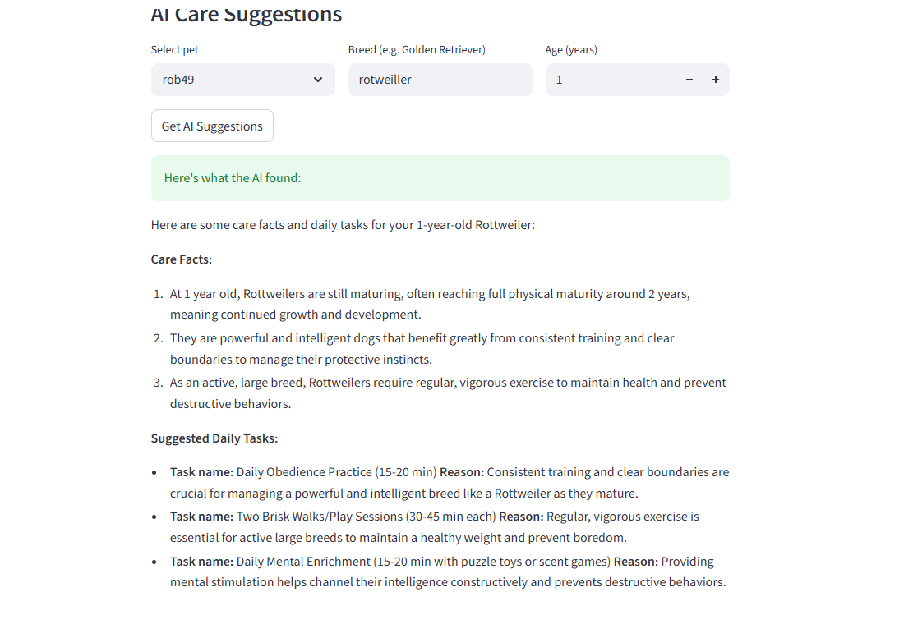
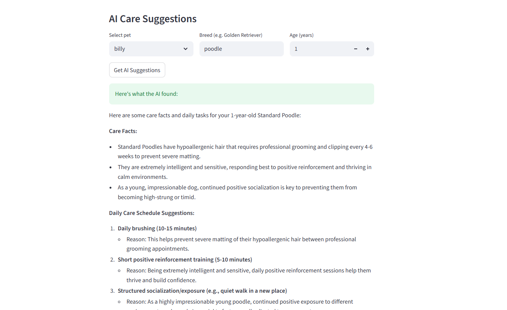

# PawPal+ AI — Intelligent Pet Care Assistant

## Origin: PawPal+

The original project, **PawPal+**, was a rule-based pet care scheduling app built in Python with a Streamlit UI. Its goal was to help busy pet owners manage daily care tasks across multiple pets by auto-generating a conflict-free, priority-sorted schedule. It could detect overlapping time windows, handle recurring tasks, and filter tasks by pet or completion status — all without any AI involvement.

---

## New Project: PawPal+ AI

PawPal+ AI upgrades the original scheduler with a **Retrieval-Augmented Generation (RAG)** feature powered by Google Gemini. When a user adds a pet — entering the species/breed and age — the system retrieves relevant care facts from a curated dog breed knowledge base (`assets/Comprehensive_Dog_Breeds_Care.json`) and passes them to Gemini along with the pet's details. Gemini then surfaces 2–3 breed and age-specific facts and proposes **three concrete tasks** to add to the schedule, each with a clear reason grounded in what was retrieved. This turns PawPal+ from a passive planner into an active advisor that helps users know *what* to schedule, not just *how*.

---

## System Design

flowchart TD
    A([User enters breed + age]) --> B[Look up breed in\nknowledge base]
    B --> C[(assets/dog_care_knowledge.json)]
    C --> D[Retrieved: care facts,\nexercise needs, health notes]
    D --> E[Build Gemini prompt:\nbreed + age + retrieved facts]
    E --> F{{Gemini API}}
    F --> G[AI Response:\n2-3 breed/age facts\n3 suggested tasks\neach with a reason]
    G --> H{User reviews\nsuggestions}
    H -->|Accepts| I[Task added to\nPawPal+ task list]
    H -->|Skips| J[No change]
    I --> K[Scheduler:\npriority sort + conflict detection]
    K --> L([Optimized daily schedule])


---

## Features

| Feature | Description |
|---|---|
| RAG Care Suggestions | Retrieves breed/age-specific facts from a JSON knowledge base, then uses Gemini to surface insights and suggest 3 tasks with reasons |
| Priority Scheduler | Sorts tasks by priority then duration; greedily fits tasks within a daily time budget |
| Conflict Detection | Identifies overlapping task windows across all pets |
| Recurring Tasks | Marks tasks complete and auto-generates the next occurrence |
| Task Filtering | Filter the task list by pet name or completion status |
| Streamlit UI | Interactive web interface with real-time schedule generation |

---

## Tech Stack

- **Python 3.10+**
- **Streamlit** — web UI
- **Google Gemini API** — AI care suggestions via RAG
- **JSON knowledge base** — curated dog care facts by breed (`assets/dog_care_knowledge.json`)
- **pytest** — 27-test suite covering sorting, recurrence, conflict detection, and filtering

---

## Setup

```bash
python -m venv .venv
source .venv/bin/activate   # Windows: .venv\Scripts\activate
pip install -r requirements.txt
```

Set your Gemini API key:

```bash
export GEMINI_API_KEY=your_key_here   # Windows: set GEMINI_API_KEY=your_key_here
```

Run the app:

```bash
streamlit run app.py
```

Run tests:

```bash
python -m pytest tests/test_pawpal.py -v
```

---

## Project Structure

```
applied-ai-system-final/
├── app.py                        # Streamlit UI
├── pawpal_system.py              # Core scheduling logic (Pet, Task, Owner, Schedule)
├── rag.py                        # RAG: knowledge base retrieval + Gemini integration
├── assets/
│   └── Comprehensive_Dog_Breeds_Care.json   # Curated breed care facts (knowledge base)
├── main.py                       # Demo / reference script
├── tests/
│   └── test_pawpal.py            # 27 unit tests
├── requirements.txt
└── README.md
```

---

## How the RAG Feature Works (Step by Step)

1. User enters a pet's breed and age in the UI.
2. The app looks up that breed in `dog_care_knowledge.json` and retrieves relevant care facts.
3. Those facts, the breed name, and the age are combined into a prompt sent to Gemini.
4. Gemini returns 2–3 facts about the breed/age and proposes 3 tasks, each with a reason tied to the retrieved data.
5. The user can accept any or all suggested tasks — accepted tasks go straight into the PawPal+ task list.
6. The existing scheduler picks up from there: priority sort, conflict detection, and daily schedule generation.

---

## Testing

The suite contains 27 tests across four areas: chronological sorting, recurring task logic, conflict detection, and task filtering. All 27 pass in under 0.1 seconds.

```bash
python -m pytest tests/test_pawpal.py -v
```

---

## Sample Interactions

### Interaction 1 — Mutt, 4 years old

**Input:** Pet: Moochi | Breed: Mutt | Age: 4



---

### Interaction 2 — Rottweiler, 1 year old

**Input:** Pet: rob49 | Breed: Rottweiler | Age: 1



---

### Interaction 3 — Poodle, 1 year old

**Input:** Pet: billy | Breed: Poodle | Age: 1



---

## Design Decisions

**Why RAG over a plain AI prompt:**
The app could have just asked Gemini "what should I do for a Golden Retriever?" without any knowledge base. The problem with that is the AI can hallucinate or give generic advice. By retrieving facts from the knowledge base first and injecting them into the prompt, the suggestions are grounded in curated, reliable information. The AI's job becomes interpretation and formatting, not fact-finding.

**Why a JSON knowledge base instead of a database or vector store:**
This is a simple app. A JSON file is easy to read, edit, and ship with the project no setup, no external service, no embeddings pipeline. For the number of breeds covered, a simple string match on the breed name is fast enough. A vector database would be the right call if the knowledge base grew to hundreds of documents, but that's over-engineering for this scope.

**Why Gemini 2.5 Flash:**
Fast, cheap, and capable enough for a structured suggestion task. The prompt is short and the output is predictable, so a lightweight model is the right fit. There's no need for a larger model here.

**Trade-off — greedy scheduler vs. optimal scheduler:**
The original scheduling engine picks tasks greedily by priority then duration. It doesn't reason about which combination of tasks best fills the day. This means a single long high-priority task can crowd out several shorter ones. The trade-off was accepted because the scheduler is transparent and predictable, and the AI suggestion layer now helps users add the *right* tasks in the first place, reducing the need for a smarter packing algorithm.

**Trade-off — no task auto-add from AI suggestions:**
The AI suggests tasks but the user has to manually enter them into the task form. An auto-add button would be a cleaner UX. The decision to keep it manual was made to keep the user in control — they see the suggestion, read the reason, and decide whether it fits their day before it hits the schedule.

---

## Testing Summary

**What worked:**

The core scheduling logic priority sorting, conflict detection, recurring tasks, and filtering  was the most solid part of the project. The 27-unit test suite caught several edge cases early (back-to-back tasks that touch but don't overlap, empty task lists, single-task schedules) and gave confidence that the engine worked before the UI was connected. The RAG feature worked well once fully wired up Gemini returned well-structured, relevant suggestions grounded in the retrieved breed facts across all test breeds including mixed breeds like Mutt that weren't in the knowledge base.

**What didn't work / required fixes:**

The biggest blocker was the API provider switch. The project originally used the Anthropic Claude API (`claude-haiku`). After switching to Google Gemini, the `anthropic` package had to be removed and replaced with `google-generativeai`, the client call pattern changed entirely, and the model ID format was different. This took debugging time but was a useful lesson in how swappable AI providers actually are when the rest of the code is cleanly separated.

The `.env` file was also not auto-loaded — `rag.py` was reading `os.environ["GEMINI_API_KEY"]` but the key only existed in a `.env` file one directory above the app. Adding `python-dotenv` and pointing `load_dotenv()` at the correct relative path fixed the `KeyError` that appeared at runtime.

The Gemini model version also needed an update mid-project `gemini-1.5-flash` was swapped for `gemini-2.5-flash` for better output quality.

**What I learned:**

Separating the AI call into its own `rag.py` module made the provider switch much easier only one file needed to change. If the Gemini call had been embedded directly in `app.py`, the swap would have been messier. Keeping AI logic isolated is worth it even in a small project. The other lesson was that `.env` file path management matters it's easy to assume the key is "set" because it's in a file, but the code still has to be explicitly told where to find it.

---

## Reflection

This project taught me two things about working with AI that I'll carry forward.

The first is to test as I code. With AI assistance it's easy to generate a lot of code quickly, but that speed means bugs can pile up just as fast. Running tests after each small addition — rather than at the end — caught issues early when they were still easy to trace and fix.

The second is to resist over-engineering. AI tools are great at suggesting elaborate solutions: caching layers, abstract base classes, vector databases, complex pipelines. Most of that wasn't needed here. Keeping the code simple and purpose-built made it easier to debug, easier to change (like swapping the AI provider), and easier to understand. The rule I landed on: build what the problem actually needs, not what sounds impressive.

